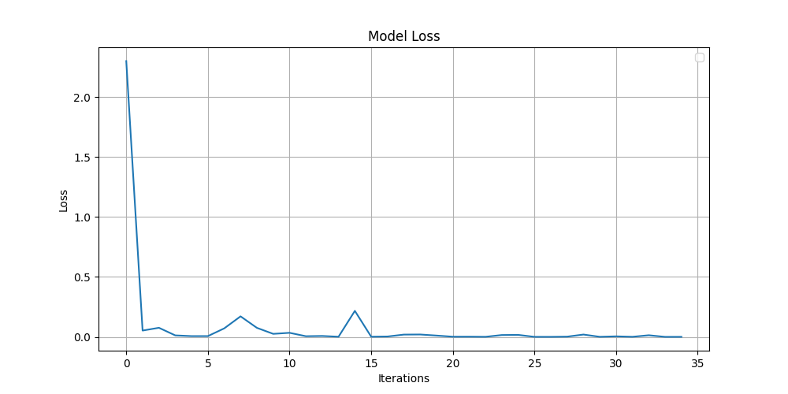

## MNIST CNN: A Toy Discriminative Project

这是一个基于 PyTorch 实现的极简卷积神经网络，可以在经典的 MNIST 手写数字数据集上完成图像分类任务。

---

### 网络架构

- **输入**: $28 \times 28$ 图像

- **结构**: $\text{input} \to \text{conv1} \to \text{conv2} \to \text{fc1} \to \text{fc2} \to \text{output}$

  - $\text{conv1}$: 卷积+激活+池化

    ```python
    # image_shape: [batch_size, 1, 28, 28] -> [batch_size, 16, 14, 14]
    self.conv1 = nn.Sequential(
        nn.Conv2d(1, 16, kernel_size=3, padding=1), 
        nn.ReLU(), 
        nn.MaxPool2d(2, 2),
    )
    ```

  - $\text{conv2}$: 卷积+激活+池化

    ```python
    # image_shape: [batch_size, 16, 14, 14] -> [batch_size, 64, 7, 7]
    self.conv2 = nn.Sequential(
        nn.Conv2d(16, 64, kernel_size=3, padding=1), 
        nn.ReLU(), 
        nn.MaxPool2d(2, 2),
    )
    ```

  - $\text{fc1}$: 展平+全连接+激活

    ```python
    # image_shape: [batch_size, 64, 7, 7] -> [256]
    self.fc1 = nn.Sequential(
        nn.Flatten(), 
        nn.Linear(64 * 7 * 7, 256),
        nn.ReLU(), 
    )
    ```

  - $\text{fc2}$: 全连接+**不需要**激活（nn.CrossEntropyLoss 自带 softmax）

    ```python
    # image_shape: [256] -> [10]
    self.fc2 = nn.Linear(256, 10)
    ```

---

### 运行训练

需要提前配置好下列环境

- Python 3.x
- PyTorch
- Torchvision
- Numpy

运行 `my_CNN.py` 开始训练。训练过程中，生成的loss曲线图片会实时自动保存至 `./loss_figure.png`

---

### 训练效果

用 train_set 训练了大约 $5$ 个 epoch 后，在 test_set 下测得的准确率稳定在 $0.99$ 上下。这时的 loss figure 如下

