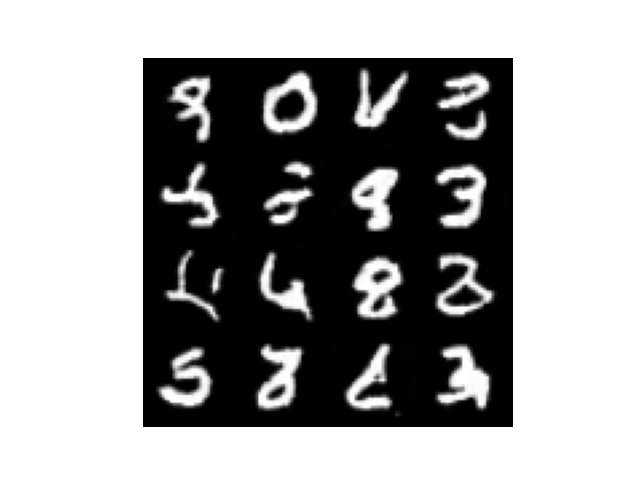
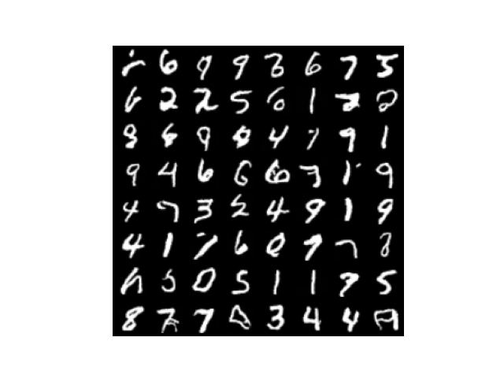
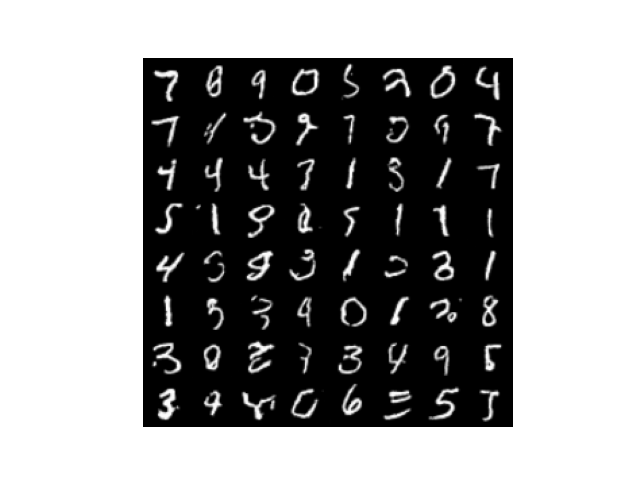
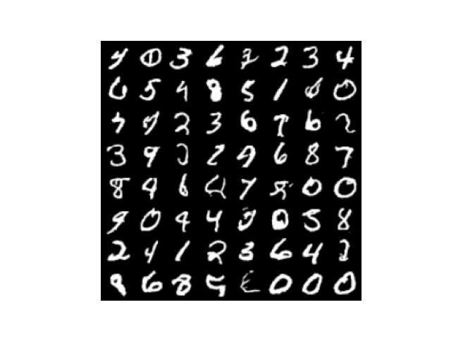
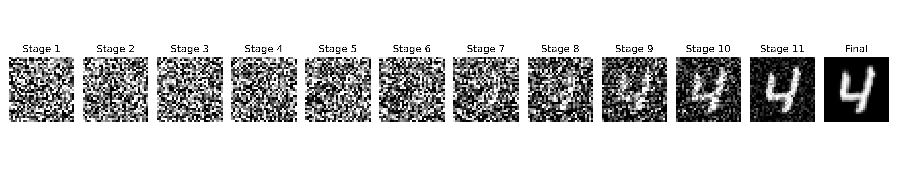
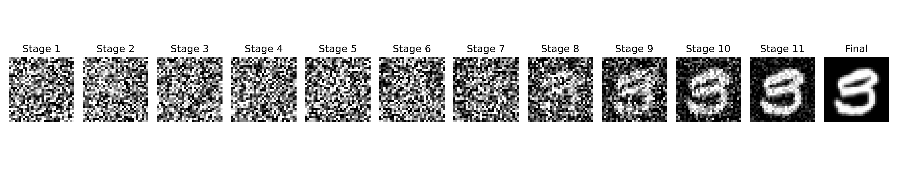

# DDPM from scratch

一个基于PyTorch实现的去噪扩散概率模型（Denoising Diffusion Probabilistic Model），用于图像生成。

## Demo

在MNIST数据集上训练了模型，能够生成类似数字的样本。然而，使用DDPM生成的样本偶尔还是会出现数字缝合的情况。

- 训练 7 epochs 之后的采样


- 训练 25 epochs 之后的采样


- 训练 50 epochs 之后的采样


- 训练 100 epochs 之后的采样



单张图片的去噪过程展示





## Features

* **纯手工 U-Net**：采用残差网络设计 U-Net，并实现了时间特征嵌入。
* **正弦位置嵌入**：完整实现了 Sinusoidal Position Embeddings 并与图像空间特征融合。

## Repository Structure

- 训练模型：`python ddpm.py`，自动读取同文件夹下保存的模型参数 `checkpoint.pth` 继续训练。
- 图片采样：`python inference.py`，生成 $64$ 张采样图片+ $1$ 张去噪过程展示图片。

```text
ddpm-from-scratch/
├──generate/		  # 保存生成的图片
├── checkpoint.pth    # 保存的模型参数，以便继续训练或进行采样
├── UNet.py           # 带时间嵌入与预激活的 ResNet U-Net 
├── ddpm.py           # 模型主体，包含前向加噪与反向采样
├── inference.py      # 读取模型参数，并进行图片采样

```

