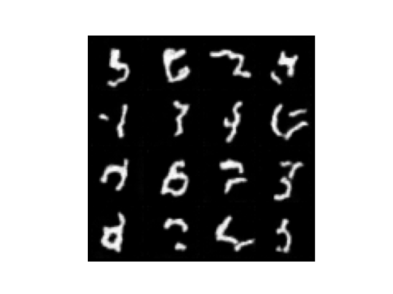

# DDPM from scratch

一个基于PyTorch实现的去噪扩散概率模型（Denoising Diffusion Probabilistic Model），用于图像生成。

## Demo

在MNIST数据集上训练了模型，能够生成类似数字的样本。然而，使用DDPM生成的样本偶尔还是会出现数字缝合的情况。

- 训练 1 epochs 之后的采样

- 训练 25 epochs 之后的采样

- 训练 50 epochs 之后的采样

- 训练 100 epochs 之后的采样

单张图片的去噪过程展示

## Features

* **纯手工 U-Net**：采用残差网络设计 U-Net，并实现了时间特征嵌入。
* **正弦位置嵌入**：完整实现了 Sinusoidal Position Embeddings 并与图像空间特征融合。

