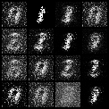
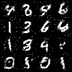
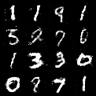
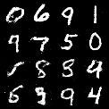

## MNIST GAN: A Toy Generative Project

这是一个基于 PyTorch 实现的极简生成对抗网络，可以在经典的 MNIST 手写数字数据集上完成图像生成任务。

---

### 核心特性

- **The "Flip" Trick**：生成器将目标函数从 $\min\limits_G \log(1-D(G(z)))$ 改为 $\max\limits_G \log(D(G(z)))$，这使得在 $D$ 较小时（$D$ 比 $G$ 更有效时）梯度较大，能够缓解梯度不平衡的现象。
- **数值稳定性优化**：
  - 数据通过 `Normalize((0.5,), (0.5,))` 被映射至 $[-1, 1]$ 区间。为对齐数据，生成器末级采用 $\tanh$ 激活函数。
  - 判别器采用 `LeakyReLU(0.2)`，保证负区间梯度持续流动，防止神经元“死亡”。
- **批归一化**：在生成器中引入 `BatchNorm1d`，保证同一batch的数据在单个神经元上的值具有一定方差。显著抑制了模式崩塌现象。
- **轻量化架构**：全连接层实现。

---

### 网络架构

#### Generator

- **输入**: 64 维随机噪声 $z$
- **结构**: $(input)64 \to 256 \to 512 \to 1024 \to (output)784$
- 隐藏层使用 `ReLU` + `BatchNorm1d`，输出层使用 `Tanh`。

#### Discriminator

- **输入**: $28 \times 28$ 图像
- **结构**: $(input)784 \to 512 \to 256 \to 128 \to (output)1$
- 隐藏层使用 `LeakyReLU(0.2)`

---

### 运行训练

需要提前配置好下列环境

- Python 3.x
- PyTorch
- Torchvision
- Numpy

运行 `my_GAN.py` 开始训练。训练过程中，生成的图像会自动保存至 `./MNIST_generate/` 目录下，generator和discriminator的损失折线图会自动保存至 `./loss_figures/` 目录下。

---

### 训练效果

- About 500 steps
  
- About 4500 steps
  
- About 10000 steps
  

- About 25000 steps
  